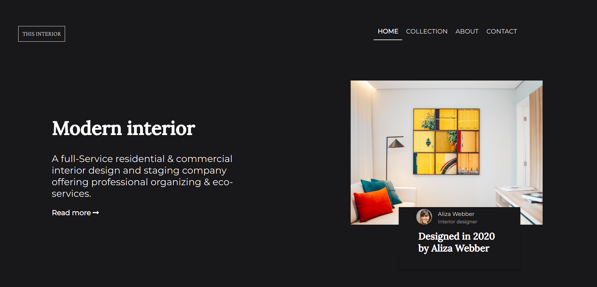

<!-- Please update value in the {}  -->

<h1 align="center">Interior Consultant</h1>

   Solution for a challenge from  <a href="http://devchallenges.io" target="_blank">Devchallenges.io</a>.

  <h3>
     | 
    <a href="https://dev-challenge-2.vercel.app/">
      Solution
    </a>
     | 
    <a href="https://devchallenges.io/challenges/Jymh2b2FyebRTUljkNcb">
      Challenge
    </a>
  </h3>

<!-- TABLE OF CONTENTS -->

## Table of Contents

- [Overview](#overview)
  - [Built With](#built-with)
- [Features](#features)
- [Contact](#contact)
- [Acknowledgements](#acknowledgements)

<!-- OVERVIEW -->

## Overview

- This one have challenge me a lot, i was looking for something to challenge my skill this one nail me in. 
- A huge improvement i have made in this challenge is on flex display i can say  flex display is awesome,before flex i was a fan of grid display but flex make me prove a say that says "Explore more and look at new angles"
- If  you want to try this one i recomend go  and check for [Flex](https://www.w3schools.com/cssref/css3_pr_flex.asp) [Media query](https://www.w3schools.com/cssref/css3_pr_mediaquery.asp) and  [some simple Js modal](https://www.w3schools.com/js/js_htmldom_html.asp)

### Built With

<!-- This section should list any major frameworks that you built your project using. Here are a few examples.-->

- Html
- Css3
- Javascript

## Features

<!-- List the features of your application or follow the template. Don't share the figma file here :) -->

This application/site was created as a submission to a [DevChallenges](https://devchallenges.io/challenges) challenge. The [challenge](https://devchallenges.io/challenges/Jymh2b2FyebRTUljkNcb) was to build an application to complete the given user stories.

## Acknowledgements

<!-- This section should list any articles or add-ons/plugins that helps you to complete the project. This is optional but it will help you in the future. For exmpale -->

- [Steps to replicate a design with only HTML and CSS](https://devchallenges-blogs.web.app/how-to-replicate-design/)
- [Node.js](https://nodejs.org/)
- [Marked - a markdown parser](https://github.com/chjj/marked)

## Contact

- Website [A simple portfolio](https://pascal488.github.io/)
- GitHub [Pascal488](https://github.com/Pascal488)
- Instgram [Follow me on IG](https://www.instagram.com/paschal_maximillian/)
